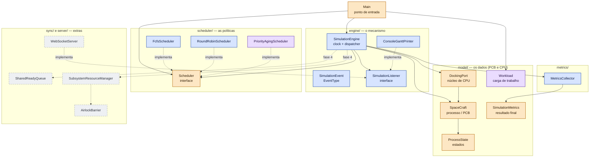
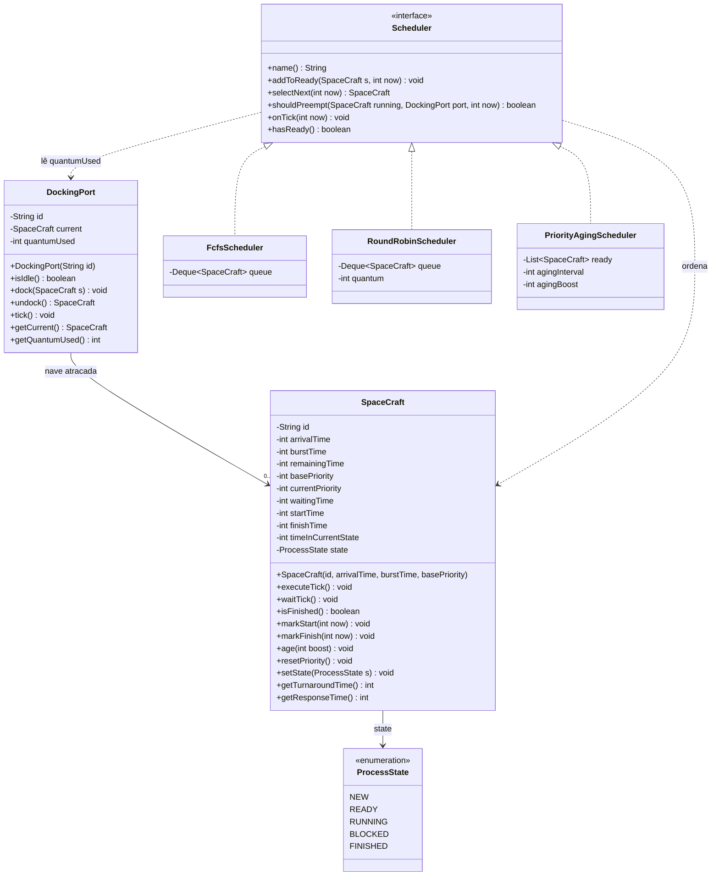
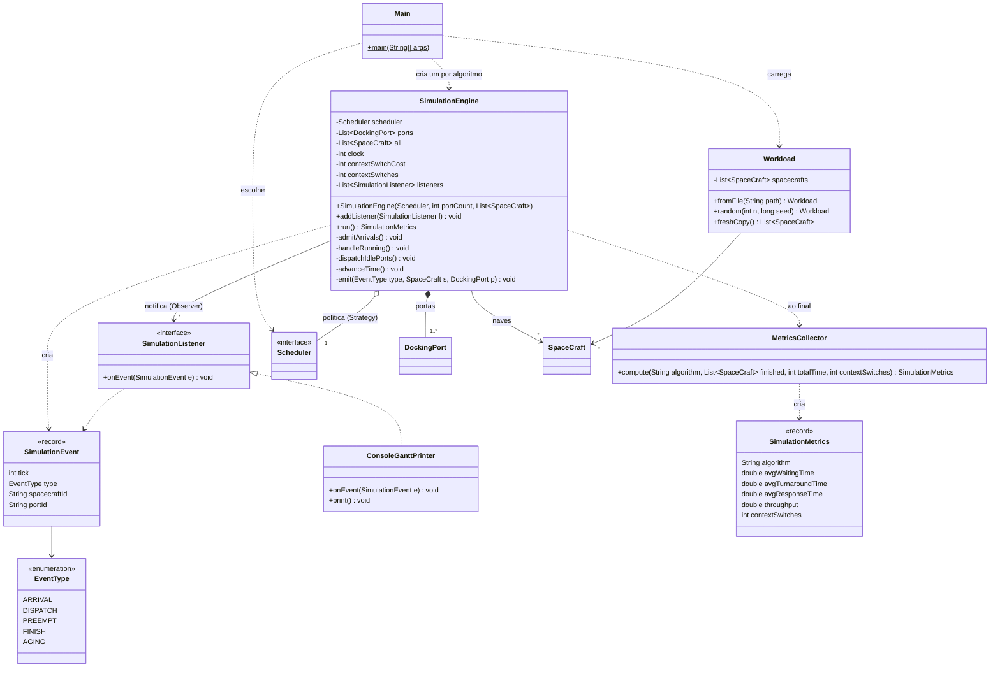
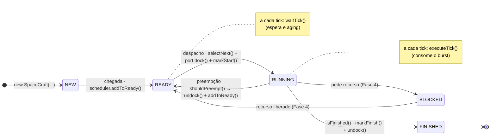
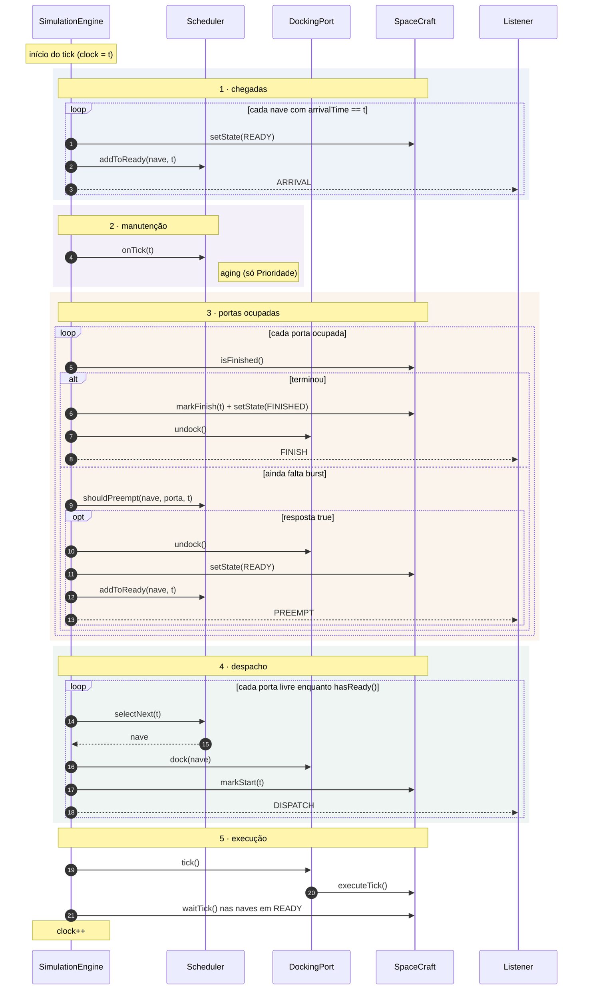
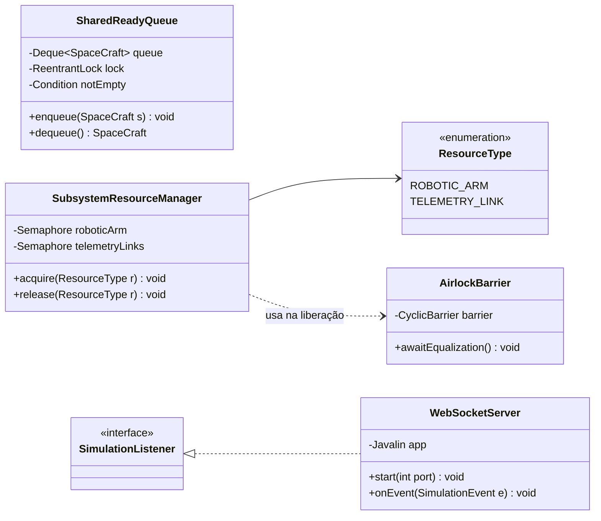

# Promethean — UML de referência

Este documento é o **mapa do projeto**: ele mostra as classes que já existem, as que ainda serão criadas e como elas conversam.
Os diagramas estão em [Mermaid](https://mermaid.js.org/), que o GitHub renderiza direto nesta página. Para alterar um diagrama, edite o bloco de texto correspondente.

> O UML descreve o **alvo**. O código atual ainda não está assim. A seção 7 mostra o que muda em cada classe e em qual fase.

**Sumário**

1. [Mapa de pacotes e status](#1-mapa-de-pacotes-e-status)
2. [Classes — domínio e escalonadores](#2-classes--domínio-e-escalonadores)
3. [Classes — motor, eventos e métricas](#3-classes--motor-eventos-e-métricas)
4. [Ciclo de vida de uma nave (estados)](#4-ciclo-de-vida-de-uma-nave-estados)
5. [Um tick do clock, passo a passo](#5-um-tick-do-clock-passo-a-passo)
6. [Fase 4 — sincronização e interface web](#6-fase-4--sincronização-e-interface-web)
7. [Checklist por classe](#7-checklist-por-classe)
8. [Como ler a notação UML](#8-como-ler-a-notação-uml)

---

## 1. Mapa de pacotes e status

Cada caixa é uma classe. A cor indica o que falta fazer.

| Cor | Significado |
|---|---|
| 🟧 Laranja | Já existe no repositório, mas precisa ser completada/ajustada (Fase 1–2) |
| 🟦 Azul | Criar no núcleo — **Fase 2** (garante o requisito de 2 algoritmos) |
| 🟪 Roxo | Criar como diferencial — **Fase 3** |
| ⬜ Cinza tracejado | Extras do README — **Fase 4** |

**A ideia central:** o `SimulationEngine` é o **mecanismo** (dono do clock e das portas). O `Scheduler` é a **política** (dono da fila de prontos). O motor pergunta, o escalonador decide. Por isso trocar de algoritmo é só trocar o objeto `Scheduler` (padrão *Strategy*).

---

## 2. Classes — domínio e escalonadores

**Como ler este diagrama**

- `SpaceCraft` é o **PCB**. Os atributos são a ficha do processo. Os métodos são os únicos jeitos de alterar essa ficha:
  - `executeTick()`: nave em RUNNING consome 1 de CPU (`remainingTime--`).
  - `waitTick()`: nave em READY acumula espera (`waitingTime++`, `timeInCurrentState++`).
  - `markStart` / `markFinish`: registram os tempos usados nas métricas. `markStart` só grava na **primeira** vez (`startTime == -1`).
  - `age` / `resetPriority`: aging. Número **menor** = prioridade **maior**, então `age` **diminui** `currentPriority` (mínimo 0).
- `DockingPort` é um **núcleo de CPU**. `quantumUsed` conta quantos ticks a nave atual já usou; o Round Robin decide olhando esse número.
- Os três escalonadores só diferem em **dois pontos**: o tipo de fila e a regra de `shouldPreempt`.

| Algoritmo | Fila | `shouldPreempt` | `onTick` |
|---|---|---|---|
| FCFS | `ArrayDeque` (FIFO) | sempre `false` | nada |
| Round Robin | `ArrayDeque` (FIFO) | `quantumUsed >= quantum && hasReady()` | nada |
| Prioridade + Aging | `List` (procura o menor `currentPriority`) | existe na fila alguém com prioridade menor que a da nave atual | a cada `agingInterval` ticks em READY, chama `age(agingBoost)` |

> Por que `List` e não `PriorityQueue` na prioridade? O `PriorityQueue` não reordena um item cuja prioridade mudou depois de inserido. Com aging, a prioridade muda o tempo todo.

---

## 3. Classes — motor, eventos e métricas

**Como ler este diagrama**

- `Main` monta tudo: carrega um `Workload`, cria **um motor por algoritmo** e imprime a tabela comparativa.
  - `Workload.freshCopy()` é importante: cada algoritmo precisa receber **naves novas**, porque a simulação altera o estado delas.
- `SimulationEngine` tem o **clock** e as **portas**. Ele não sabe qual algoritmo está rodando; só chama os métodos da interface `Scheduler`.
  - A lista `all` guarda todas as naves. É por ela que o motor chama `waitTick()` nas naves em READY, sem precisar mexer na fila do escalonador.
- **Observer:** o motor não imprime nada. Ele emite `SimulationEvent`s e quem quiser escuta. Hoje é o `ConsoleGanttPrinter`; na Fase 4, o `WebSocketServer` escuta os **mesmos** eventos. Os testes também podem escutar.
- `MetricsCollector` calcula as métricas do README a partir das naves finalizadas:

| Métrica | Fórmula |
|---|---|
| Espera média | média de `waitingTime` |
| Turnaround médio | média de `finishTime − arrivalTime` |
| Resposta média | média de `startTime − arrivalTime` |
| Throughput | naves finalizadas ÷ tempo total |
| Trocas de contexto | contador `contextSwitches` do motor |

> `SimulationMetrics` já existe em `model/`. Pode continuar lá; o diagrama sugere transformá-la em `record` (Java 16+), porque é um resultado imutável.

---

## 4. Ciclo de vida de uma nave (estados)

Cada seta mostra **o evento** e **quais métodos** fazem a transição.

> O enum atual tem `WAITING` e `TERMINATED`. O alvo usa só `BLOCKED` (mesmo significado de `WAITING`) e `FINISHED` (nome usado no README).

---

## 5. Um tick do clock, passo a passo

A **ordem** destes passos muda os resultados, principalmente no Round Robin. Esta é a convenção dos livros: quem chega no tick `t` entra na fila **antes** de quem foi preemptado no mesmo tick.

**Custo da troca de contexto (Δt), Fase 3:** quando uma porta recebe uma nave diferente da anterior, ela fica `contextSwitchCost` ticks "manobrando" antes de a nave começar a executar. O motor soma 1 em `contextSwitches` a cada troca.

---

## 6. Fase 4 — sincronização e interface web

Só depois que o núcleo (Fases 1–3) estiver funcionando e testado. O motor determinístico continua gerando as métricas; esta camada mostra as primitivas de sincronização do README.

| Classe | Primitiva | Conceito de SO |
|---|---|---|
| `SharedReadyQueue` | `ReentrantLock` + `Condition` | Produtor-consumidor: `dequeue` faz `await()` com a fila vazia; `enqueue` faz `signal()` |
| `SubsystemResourceManager` | `Semaphore(1)` braço, `Semaphore(2)` links | Recurso de capacidade finita; quem não consegue `acquire()` vai para BLOCKED; `release()` sempre no `finally` |
| `AirlockBarrier` | `CyclicBarrier` | Várias threads só seguem quando **todas** chegaram (pressão + trava da escotilha) |
| `WebSocketServer` | Javalin | Envia os mesmos `SimulationEvent`s do console para a página em `localhost:7070` |

---

## 7. Checklist por classe

| Classe | Pacote | Conceito de SO | Situação hoje | O que fazer | Fase |
|---|---|---|---|---|---|
| `ProcessState` | model | Estados do processo | Tem `WAITING` e `TERMINATED` | Deixar `NEW, READY, RUNNING, BLOCKED, FINISHED` | 1 |
| `SpaceCraft` | model | PCB | Campos certos, só getters; `remainingTime` é `final`; tempos em `float` | Tempos em `int`; `remainingTime = burstTime` no construtor; adicionar os métodos da seção 2 | 1 |
| `DockingPort` | model | Núcleo de CPU | `dock`/`undock` prontos; parâmetro inútil no construtor | Construtor só com `id`; renomear `quantumTime` → `quantumUsed`; criar `tick()` e `getCurrent()` | 1 |
| `Scheduler` | scheduler | Escalonador de curto prazo | Interface vazia | Declarar os 6 métodos | 2 |
| `FcfsScheduler` | scheduler | FCFS | — | Criar | 2 |
| `RoundRobinScheduler` | scheduler | RR com quantum | — | Criar | 2 |
| `SimulationEngine` | engine | Dispatcher + clock | — | Criar com 1 porta | 2 |
| `SimulationEvent`, `EventType`, `SimulationListener`, `ConsoleGanttPrinter` | engine | Registro/linha do tempo | — | Criar | 2 |
| `MetricsCollector` | metrics | Métricas de avaliação | — | Criar | 2 |
| `SimulationMetrics` | model | Resultado | Classe vazia | Preencher (ou virar `record`) | 2 |
| `Main` | raiz | — | Vazia | Rodar FCFS e RR e imprimir a tabela | 2 |
| Testes JUnit | `src/test` | — | Não existem | Casos calculados à mão (espera e turnaround) | 2 |
| `PriorityAgingScheduler` | scheduler | Prioridade preemptiva + aging | — | Criar | 3 |
| Várias portas + Δt | engine | Multinúcleo + troca de contexto | — | Estender o motor | 3 |
| `Workload` | model | Carga de trabalho | — | Ler JSON e gerar aleatório com seed | 3 |
| `sync/*`, `server/*` | sync, server | Sincronização e interface | — | Criar | 4 |

---

## 8. Como ler a notação UML

| Símbolo | Nome | Significado neste projeto |
|---|---|---|
| `A <\|.. B` (triângulo, linha tracejada) | Realização | `B` **implementa** a interface `A` (ex.: `FcfsScheduler` implementa `Scheduler`) |
| `A *-- B` (losango cheio) | Composição | `A` **cria e é dono** de `B`; `B` não existe sem `A` (motor → portas) |
| `A o-- B` (losango vazio) | Agregação | `A` **usa** `B`, mas `B` vem de fora (o escalonador é passado ao motor) |
| `A --> B` (seta cheia) | Associação | `A` guarda uma referência para `B` como atributo |
| `A ..> B` (seta tracejada) | Dependência | `A` só usa `B` de passagem (parâmetro, retorno, criação) |
| `"1"`, `"0..1"`, `"*"`, `"1..*"` | Multiplicidade | Quantos objetos participam (ex.: uma porta tem 0 ou 1 nave) |
| `+` / `-` | Visibilidade | `public` / `private` |
| `<<interface>>`, `<<enumeration>>`, `<<record>>` | Estereótipo | Tipo especial de classe em Java |
